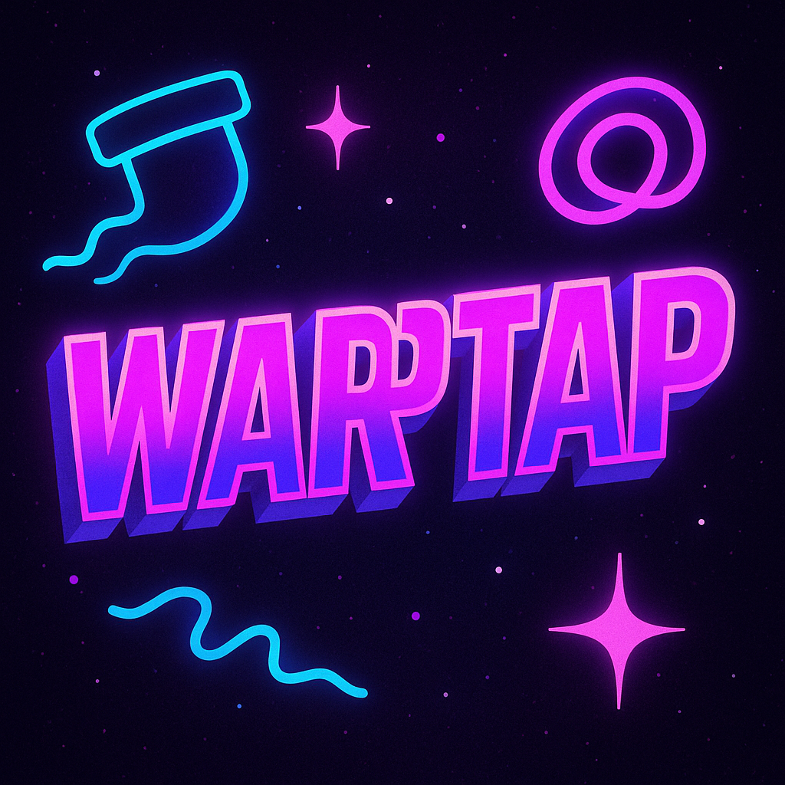

<div align="center">
  

  # 🚀 WarpTap

  **Farcaster Miniapp Game**  
  ⚡ Built on Monad · 🎮 Tap to Win · 🧠 Skill-Based

</div>

---

## 🔥 What is this?

**WarpTap** is a fast-paced onchain mini-game designed for **Farcaster** users.

- ⏱️ Each round lasts **60 seconds**
- 🥇 Top player every **4 hours** gets **90% of the prize pool**
- 🎮 Entry fee: **5 $MON**
- 📊 Fully transparent & onchain using smart contracts

---

## 🕹 How to play?

1. Visit: [https://warptap.vercel.app](https://warptap.vercel.app)
2. Pick a character (Robot 🤖 / Frog 🐸 / Dog 🐶)
3. Enter your nickname and connect your MetaMask
4. Tap the coins as fast as you can to earn points
5. Your score is submitted and stored onchain

---

## 🧱 Tech Stack

- HTML / CSS / JavaScript
- `ethers.js`
- **Monad** blockchain
- **Vercel** deployment
- **Farcaster Miniapp** integration

---

## 📦 Deployment

```bash
git clone https://github.com/donatik27/warptap.git
cd warptap
npm install
vercel --prod
